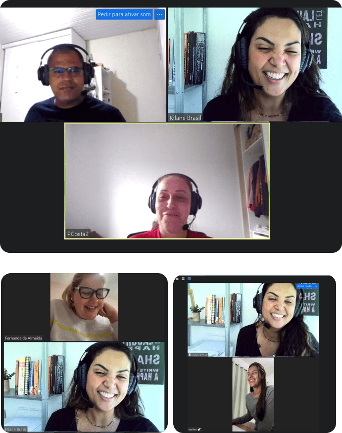
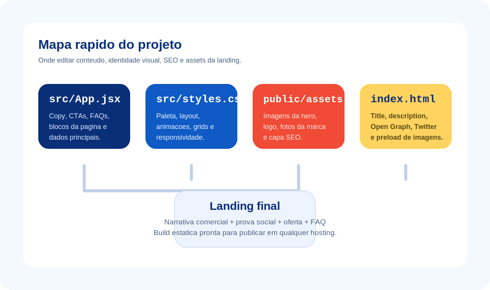

<p align="center">
  
</p>

<p align="center">
  
  
  
  
</p>

<p align="center">
  <a href="#visao-geral">Visao geral</a> |
  <a href="#preview">Preview</a> |
  <a href="#destaques">Destaques</a> |
  <a href="#stack">Stack</a> |
  <a href="#como-rodar">Como rodar</a> |
  <a href="#publicacao">Publicacao</a>
</p>

# Easy English Now

Landing page premium para promover o produto digital `Easy English Now`, desenvolvida com `React + Vite` e desenhada para conversao direta via Hotmart.

O projeto entrega uma pagina comercial de alto impacto com narrativa objetiva, prova social, oferta clara e CTA direto para checkout externo.

## Visao geral

- Hero forte com headline dinamica e CTA principal
- Splash screen com identidade da marca
- Blocos de dor, processo, prova social e oferta
- FAQ em acordeao para reducao de objecoes
- CTA fixo para mobile e navegacao pensada para conversao
- SEO basico, Open Graph e Twitter Card configurados

> Projeto estatico, sem backend e sem CMS. Toda a edicao principal acontece no front-end.

## Preview

| Capa social | Hero desktop |
| --- | --- |
|  |  |

| Hero mobile | Bloco de autoridade |
| --- | --- |
|  |  |

## Destaques

| Area | O que entrega |
| --- | --- |
| Conversao | CTA principal no hero, CTA fixo no mobile e oferta com gatilhos de seguranca |
| Autoridade | Imagens da Teacher Kilane, prova social e promessa clara de transformacao |
| Experiencia | Layout responsivo, identidade visual forte e leitura guiada por secoes |
| Conteudo | Dores do publico, explicacao do metodo, beneficios, FAQ e reforco de oferta |
| SEO | `title`, `description`, `keywords`, Open Graph, Twitter Card e favicon |

## Mapa rapido

<p align="center">
  
</p>

## Estrutura da landing

1. Splash de entrada com logo da marca.
2. Hero com headline dinamica, CTA e sinais de confianca.
3. Bloco de dor para conectar com o publico.
4. Explicacao simples do metodo em 3 passos.
5. Prova social com numeros e reforco de garantia.
6. Apresentacao da Teacher Kilane.
7. Lista de entregaveis da oferta.
8. Oferta final com CTA para Hotmart.
9. FAQ para reduzir objecoes antes da compra.

## Stack

- `React 19`
- `Vite 6`
- `lucide-react`
- CSS puro em `src/styles.css`
- Assets estaticos em `public/assets`

## Estrutura do projeto

```text
.
|-- docs/
|   `-- readme/                   # assets visuais usados neste README
|-- public/
|   `-- assets/                   # imagens da landing, logo, favicon e capa SEO
|-- src/
|   |-- App.jsx                   # estrutura da pagina, copy e dados principais
|   |-- main.jsx                  # bootstrap do React
|   `-- styles.css                # identidade visual, layout e responsividade
|-- dist/                         # build final para deploy
|-- _reference/                   # referencias visuais originais
|-- index.html                    # SEO, metadados e preload de imagens
|-- package.json
`-- vite.config.js
```

## Como rodar

### Requisitos

- `Node.js` 18 ou superior
- `npm`

### Instalacao

```bash
npm install
```

### Desenvolvimento

```bash
npm run dev
```

### Build de producao

```bash
npm run build
```

### Preview local da build

```bash
npm run preview
```

## Scripts

| Script | Uso |
| --- | --- |
| `npm run dev` | inicia o ambiente local com hot reload |
| `npm run build` | gera a build final em `dist/` |
| `npm run preview` | sobe uma visualizacao local da build pronta |

## Onde editar cada parte

| Arquivo | Responsabilidade |
| --- | --- |
| `src/App.jsx` | copy, links, estrutura das secoes, FAQs e chamadas principais |
| `src/styles.css` | cores, espacamento, tipografia, grids, animacoes e responsividade |
| `public/assets/` | imagens da hero, fotos da marca, logo, favicon e capa de compartilhamento |
| `index.html` | `title`, `description`, `keywords`, Open Graph, Twitter Card e preloads |

## Pontos de customizacao rapida

- Atualize `hotmartLink` e `instagramLink` em `src/App.jsx`
- Revise os arrays de `heroWords`, `painPoints`, `processSteps`, `proofCards` e `faqItems`
- Troque as imagens em `public/assets` mantendo os nomes ou atualizando os caminhos no componente
- Ajuste a paleta e os tokens globais em `:root` dentro de `src/styles.css`

## Publicacao

Depois de gerar a build:

```bash
npm run build
```

publique a pasta `dist/` em qualquer hosting estatico:

- Vercel
- Netlify
- Cloudflare Pages
- GitHub Pages
- hospedagem estatica tradicional

## Checklist antes de publicar

- confirmar o link real do checkout
- revisar Instagram e demais links externos
- validar copy, preco, garantia e numeros da oferta
- revisar imagens finais em `public/assets`
- validar SEO e compartilhamento em `index.html`
- testar a pagina em mobile e desktop

## Observacoes

- Nao ha backend ou painel administrativo
- O conteudo esta hardcoded em `src/App.jsx`
- A base atual e ideal para campanhas rapidas e ajustes visuais com baixo atrito

## Proximos passos recomendados

- adicionar analytics e eventos de conversao
- integrar pixel do Meta e Google Ads
- externalizar conteudo para JSON ou CMS
- criar testes basicos de renderizacao
- preparar variantes A/B de headline e oferta
